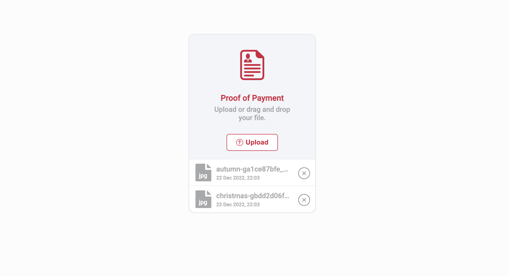

# Proof Of Payment

Proof Of Payment (POP) is an example source code for uploading files and it is customized by the component. It has made by React and Redux and supported by Typescript. It hides the file component HTML and gives reference to the component that is built using HTML tags and CSS.

## Demo



## Project Structure

```
├── __test__
├── node_modules
├── public
│   ├── index.html
├── src
│   ├── components
│   │   ├── list
│   │   │   ├── index.tsx
│   │   ├── proof
│   │   │   ├── index.tsx
│   ├── entitas
│   │   ├── index.ts
│   ├── icon
│   │   ├── *.tsx
│   ├── store
│   │   ├── index.ts
│   │   ├── slices.ts
│   ├── utils
│   │   ├── index.ts
│   ├── App.tsx
│   ├── style.css
├── types
│   ├── index.d.ts
├── index.tsx
├── .babelrc
├── .gitignore
├── package.json
├── package-lock.json
├── tsconfig.json
├── webpack.config.js
```

#### Entitas

The entity is a contract-like interface that can be used to define data from mistakes and make it consistent.

```bash
...
export class FilesEntitas {
    uuid: number;
    title: string;
    extension: string;
    size: number;
    file: string;
    date: string;

    constructor(
        uuid: number,
        title: string,
        extension: string,
        size: number,
        file: string,
        date: string
    ) {
        this.uuid = uuid;
        this.title = title;
        this.extension = extension;
        this.size = size;
        this.file = file;
        this.date = date;
    }
}
...
```

#### Redux Slices

Actually, POP doesn't need redux to manage the state by reduces because it is not a complex project. However, I only implement it to give you an understanding of how to use redux-toolkit.

```bash
...
const options = {
    name: "proof",
    initialState: Array<FilesEntitas>,
    reducers: {
        addProof(state: Array<FilesEntitas>, action: ActionEntitas) {
            return [...state, action.payload]
        },
        removeProof(state: Array<FilesEntitas>, action: ActionEntitas) {
            return state.filter((item: FilesEntitas) => item.uuid !== action.payload.uuid)
        }
    }
}
...
```

#### Components

POP is separated into two components. One is a component for performing the upload action, the other is for displaying a list of results.

### Icons

POP creates component Icons by converting SVG files into the script.

```bash
...
<svg
      xmlns="http://www.w3.org/2000/svg"
      viewBox="0 0 252 252"
      fill="#a7a8aa"
      width="24"
    >
      <g>
        <path
          d="M126,0C56.523,0,0,56.523,0,126s56.523,126,126,126s126-56.523,126-126S195.477,0,126,0z M126,234
		c-59.551,0-108-48.449-108-108S66.449,18,126,18s108,48.449,108,108S185.551,234,126,234z"
        />
        <path
          d="M164.612,87.388c-3.515-3.515-9.213-3.515-12.728,0L126,113.272l-25.885-25.885c-3.515-3.515-9.213-3.515-12.728,0
		c-3.515,3.515-3.515,9.213,0,12.728L113.272,126l-25.885,25.885c-3.515,3.515-3.515,9.213,0,12.728
		c1.757,1.757,4.061,2.636,6.364,2.636s4.606-0.879,6.364-2.636L126,138.728l25.885,25.885c1.757,1.757,4.061,2.636,6.364,2.636
		s4.606-0.879,6.364-2.636c3.515-3.515,3.515-9.213,0-12.728L138.728,126l25.885-25.885
		C168.127,96.601,168.127,90.902,164.612,87.388z"
        />
      </g>
    </svg>
...
```

## License

MIT © [faridho](https://github.com/faridho)
